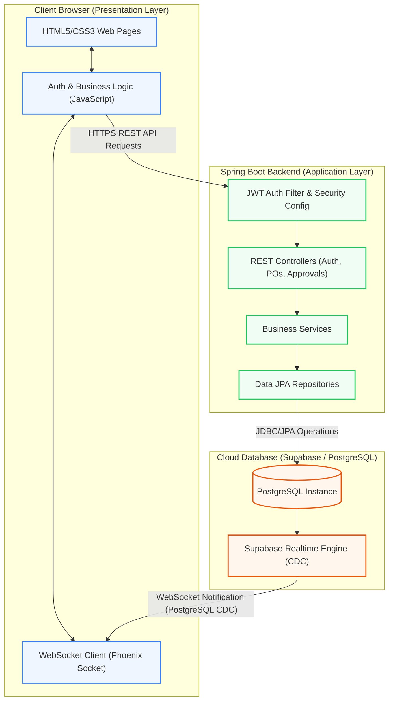
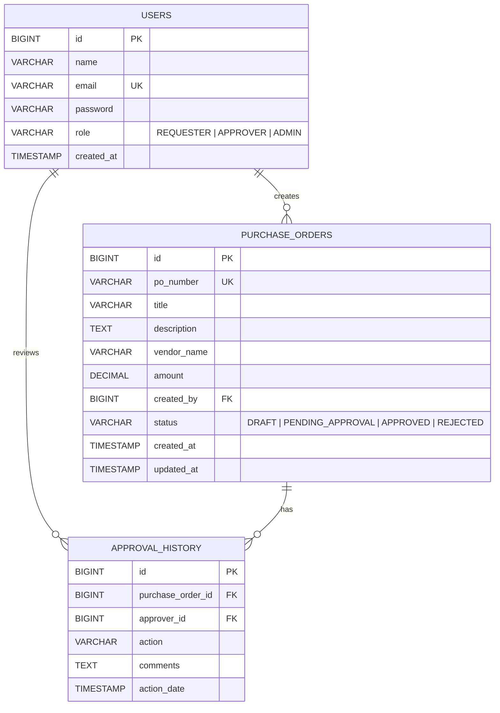

# 🏢 Purchase Order Approval Workflow System

A comprehensive web application designed to streamline the creation, tracking, and approval workflow of Purchase Orders (POs). The system features custom role-based access control, a secure Spring Boot backend, a real-time responsive frontend, and cloud-synchronized data storage.

---

## 📐 System Architecture

The application is built on a **Decoupled Client-Server Architecture** utilizing a three-tier design pattern:
1. **Presentation Layer (Frontend)**: A lightweight, responsive UI built with semantic HTML5, Vanilla CSS, and modern asynchronous JavaScript. It connects to the backend REST APIs and opens a direct WebSocket connection to the cloud database provider for real-time reactive updates.
2. **Application Layer (Backend)**: A robust REST API backend powered by **Spring Boot**, utilizing Spring Security, custom JWT authentication, and Spring Data JPA.
3. **Database Layer (Data Store)**: A cloud-hosted **PostgreSQL** instance managed on Supabase.

### 🔄 Architectural Flow Diagram



---

## 🛠️ Technology Stack

### **Frontend**
*   **Structure**: Semantic HTML5 with dynamic component loading.
*   **Styling**: Vanilla CSS featuring modern layout engines (Flexbox, Grid), CSS variables for themes, and glassmorphic dashboard designs.
*   **Logic**: Asynchronous ES6 JavaScript (Fetch API).
*   **Realtime Subscriptions**: Native `WebSocket` integration using the Phoenix Socket protocol to subscribe directly to PostgreSQL Change Data Capture (CDC) events broadcast by Supabase.

### **Backend**
*   **Framework**: **Spring Boot 3.3.2**
*   **Language**: **Java 17**
*   **Security**: Spring Security configured with custom Stateless JWT Authentication.
*   **ORM / Data Access**: Spring Data JPA with Hibernate.
*   **Build Tool**: Maven

### **Database & Deployment Hosting**
*   **Engine**: PostgreSQL (Compatible with version 15+)
*   **Cloud Host**: Supabase (Database + Realtime Broadcasting Engine)

---

## 🗄️ Database Schema & Roles

The system uses three primary tables to manage users, orders, and audit history:



### Role-Based Access Control (RBAC) Matrix

| User Role | Permitted Actions |
| :--- | :--- |
| **REQUESTER** | Create/Edit Draft POs, Submit POs for Approval, View Personal PO History |
| **APPROVER** | View Pending POs, Approve POs, Reject POs with Comments |
| **ADMIN** | System Oversight, User Management, Audit Logs, Override Statuses |

---

## 🔌 API Endpoints

All backend endpoints are prefixed with `/api`. Protected routes require a valid `Authorization: Bearer <JWT_TOKEN>` header.

### **Authentication & Public Endpoints**
*   `POST /api/auth/register` - Create a new user account.
*   `POST /api/auth/login` - Authenticate user and obtain JWT token.
*   `GET /api/health` - Check backend service and database health status.

### **Purchase Orders Management**
*   `GET /api/purchase-orders` - Retrieve list of all POs (Filtered by role permissions).
*   `GET /api/purchase-orders/{id}` - Get details of a specific PO.
*   `POST /api/purchase-orders` - Create a new Purchase Order.
*   `PUT /api/purchase-orders/{id}` - Update a PO (only draft/pending status).
*   `PUT /api/purchase-orders/{id}/submit` - Submit a draft PO for approval.

### **Approvals & History**
*   `POST /api/purchase-orders/{id}/approve` - Approve a pending PO (Approver only).
*   `POST /api/purchase-orders/{id}/reject` - Reject a pending PO with comments (Approver only).
*   `GET /api/purchase-orders/{id}/history` - Retrieve approval audit trails for a specific PO.

---

## 🚀 Local Setup Guide

### 📋 Prerequisites
*   **Java Development Kit (JDK)** Version 17 or higher
*   **Maven** installed (or use the included wrapper `./mvnw`)
*   A running **PostgreSQL** database (Local or Cloud instance)

---

### 1️⃣ Database Setup
1. Create a database in your PostgreSQL cluster.
2. Execute the initialization schema located in:
   [schema.sql](file:///d:/purch%20app%20prj/database/schema.sql)
3. Insert mock users into the database if needed (examples are available at the bottom of the SQL script).

---

### 2️⃣ Backend Configuration
Open the backend configuration file:
[application.properties](file:///d:/purch%20app%20prj/backend/src/main/resources/application.properties)

Ensure the database URL, username, and password environment variables are exported, or customize the fallback default configurations directly:
```properties
spring.datasource.url=jdbc:postgresql://<host>:<port>/<db_name>
spring.datasource.username=<username>
spring.datasource.password=<password>
jwt.secret=<your_base64_jwt_secret>
```

To run the Spring Boot backend server, navigate to the `backend` directory and execute:
```bash
./mvnw spring-boot:run
```
The server will start on port `8080`. You can test connection status by visiting: `http://localhost:8080/api/health`.

---

### 3️⃣ Frontend Configuration
The frontend communicates directly with the backend using the local endpoint URL defined in the configuration scripts:
*   [app.js](file:///d:/purch%20app%20prj/frontend/app.js)
*   [auth.js](file:///d:/purch%20app%20prj/frontend/auth.js)

Since the frontend is built using standard client-side files, you can launch it using any lightweight local server utility:
*   **VS Code Live Server** extension (Recommended)
*   **Python Simple HTTPServer**: Run `python -m http.server 3000` from the `frontend` folder.
*   Opening [index.html](file:///d:/purch%20app%20prj/frontend/index.html) directly in any modern web browser.

---

## 🔐 Security Details
*   **Stateful Credentials hashing**: User passwords are saved utilizing secure cryptographic hashes.
*   **Token-Based API Access**: Upon logging in, clients receive a stateless JSON Web Token (JWT). The JWT is stored in local browser storage (`LocalStorage`) and attached as a header in subsequent API calls.
*   **JWT Verification Filter**: [JwtAuthenticationFilter.java](file:///d:/purch%20app%20prj/backend/src/main/java/com/poapp/config/JwtAuthenticationFilter.java) validates the JWT on every incoming request, parsing claims to populate the Spring Security Context before proceeding to controllers.
